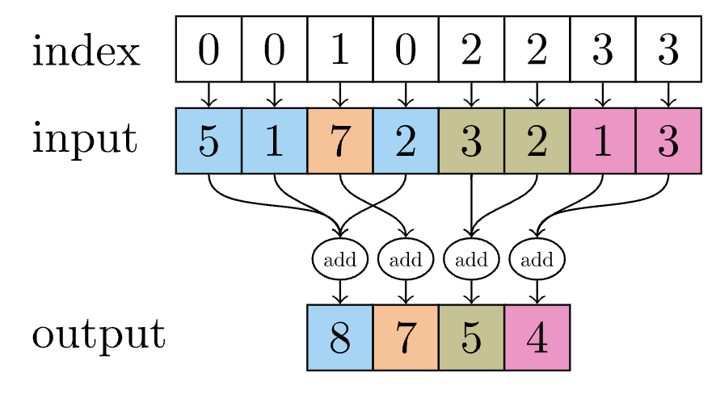

# Model
Currently, this model zoo supports the following four architectures, but I try to develop this repo with modularity, you can do the combination of these encoder, processor and decoder and generate the new architectures. Next, I will illustrate the difference between these models.

|Model | Encoder | Processor | Decoder|
-------| --------|-----------|--------|
|GINO| GNO | FNO | GNO|
|RIGNO| MP | MP | MP|
|MeshGraphNet| MLP | MP | MLP|
|AIFS | MP | Transformer| MP|


## GINO
Geometry informed Neural Operator
### Encoder
Support four different kernels:
|Kernels| Formula|
|-------|--------|
|Linear Kernel|$\int_{A(x)} k(x, y) d y$|
|Linear Kernel with input|$\int_{A(x)} k(x, y) \cdot f(y) d y$|
|Nonlinear kernel| $\int_{A(x)} k(x, y, f(y)) d y$|
|Nonlinear kernel with input|$\int_{A(x)} k(x, y, f(y)) \cdot f(y) d y$|

where $x$ is the specified point of the output function. $y$ is the specified point of the input function. The$y$ and $x$ can be different. $A(x)$ is that for every point $x$, we need a group of $y$ point to do the integration. So this is basically a local operator, not a non-local operator like Fourier Domain.

How to define the $A(x)$?
The answer is that we can Find the neighbors, in data, of each point in queries within a ball of radius, and store them into a dictionary with keys: "neighbors_index" and "neighbors_row_splits". In 3D, this process can be accelerated with open3d library.

After Build the neighbors connection, we should do:
1. concatenate the features [x, y, f(y)], because one x correponds to multiple y, therefore, x should be repeat the k number of times, the k means the number of neighbors.
2. Use an MLP to apply these concatenated features. which is kernel function. the input dimension is the [x,y,f(y)], but we have another dimension which can be the number of edges. You can view that these information is stored on the edge. 
3. Apply the numerical quadrature, because we want to calculate this integral, now we have already calculated the results for every $A(x)$. 
3. Finally, this information is like stored on the edge, therefore, we need to aggregate the information from these edges to the node. We need a Edge2Node process. His original code use [torch_scatter](https://github.com/rusty1s/pytorch_scatter/tree/master) to quickly implement this process. If you don't successfully install the torch_scatter, it can use the naive PyTorch implementation to achieve it.


### Processor
1. lifting
2. Just pass several ordinary Fourier Neural Operator block.

### Decoder
1. add positional embedding (optional).
2. pass the GNO
3. projection.

## RIGNO
### Encoder
1. Construct the Bipartite graph. 
    - In RIGNO, the node for regional node is randomly sampled from the physical nodes. 
    - apply medium to generate the radius of the regional node for physical node.
    - Construct the graph 
2. Aggregate the information using scatter.
    - original code use jraph.segment_mean. [Jraph](https://github.com/google-deepmind/jraph) is a library for building graph neural networks in JAX. 
    - Illustration: the original code use the TypedGraph structures implemented with JAX and Flax, allowing for multiple types of nodes and edges within the same graph. This flexibility is mainly essential for accurately modelling heterogeneous systems where different entities and interactions have distinct properties.

### Processor
1. Use Delaunay algorithm on these regional nodes. Then Randomly sample the points, and use scipy.spatial Delaunay to build new edges. This process will be continued with several times.
2. Do the message passing on this regional nodes.

### Decoder
1. Construct the Biparatite graph.
2. Do the MLP and aggregate the information.

## MeshGraphNet
### Encoder
Without changing the graph structures, just use MLP to do the channel encoding (lifting).
### Processor
Multilayer of Message Passing. 
### Decoder
MLP to do the projection.
## AIFS
### Encoder


### Processor
| Transformer | Characteristics | Complexity| Drawbacks|
|-------------|-----------------|-----------|----------|
|Transformer with flash attention|kernel fusion, directly process in the register and shared memory without saving intermediate results, avoid the access of global memory.|space: $\mathcal{O}(n)$ time:$\mathcal{O}(n^2)$| implementation|
|Swin Transformer| Shifted window attention | $\mathcal{O}(n^2)$ $\rightarrow$ $\mathcal{O}(n\cdot w^2)$| more layer and carefully parameter tunning|
|Local Attention| local regional attention calculation | $\mathcal{O}(n\cdot k)$ | hard to capture long-dependent data.|


```
    "model": {
        "name": "rano",
        "drop_edge": 0.0,
        "use_conditional_norm": false,
        "variable_mesh": false,
        "args":{
            "patch_size": 2,
            "deepgnn": {
                "node_latent_size": 16,
                "edge_latent_size": 16,
                "num_message_passing_steps": 3,
                "use_node_encode": true,
                "use_edge_encode": true,
                "use_node_decode": true,
                "use_edge_decode": true,
                "mpconfig": {
                    "aggregate": "mean",
                    "aggregate_normalization": null,
                    "use_node_fn": true,
                    "use_edge_fn": true,
                    "edge_fn_config": {
                        "hidden_size": 64,
                        "num_layers": 3,
                        "activation": "swish",
                        "use_layer_norm": true,
                        "use_conditional_norm": false,
                        "cond_norm_hidden_size": 4
                    },
                    "node_fn_config": {
                        "hidden_size": 64,
                        "num_layers": 3,
                        "activation": "swish",
                        "use_layer_norm": true,
                        "use_conditional_norm": false,
                        "cond_norm_hidden_size": 4
                    }
                }
            },
            "transformer": {
                "hidden_size": 256,
                "use_attn_norm": true,
                "use_ffn_norm": true,
                "norm_eps": 1e-6,
                "num_layers": 3,
                "attn_config": {
                    "hidden_size": 256,
                    "num_heads": 8,
                    "num_kv_heads": 8,
                    "use_conditional_norm": false,
                    "cond_norm_hidden_size": 4
                },
                "ffn_config": {
                    "hidden_size": 256,
                    "use_conditional_norm": false,
                    "cond_norm_hidden_size": 4      
                }
            }
        }
    },
```
|Argument| Function|
|--------|---------|
|variable_mesh| if desginated, the output points can differ from the input points.|
|use_conditional_norm| If set to true, using the time-conditioned layer for NN|
|node_latent_size| In the encoder, decoder, and MP (processor), the latent dimension of the node.|
|edge_latent_size| the latent dimension of the edge.|
|hidden_size| The hidden size layer for the edge_fn and node_fn (MLP)|


## LANO
encoder: input_size -> embedding (lifting size) -> GNOEncoder (lifting size)
processor: lifting size -> Transformer